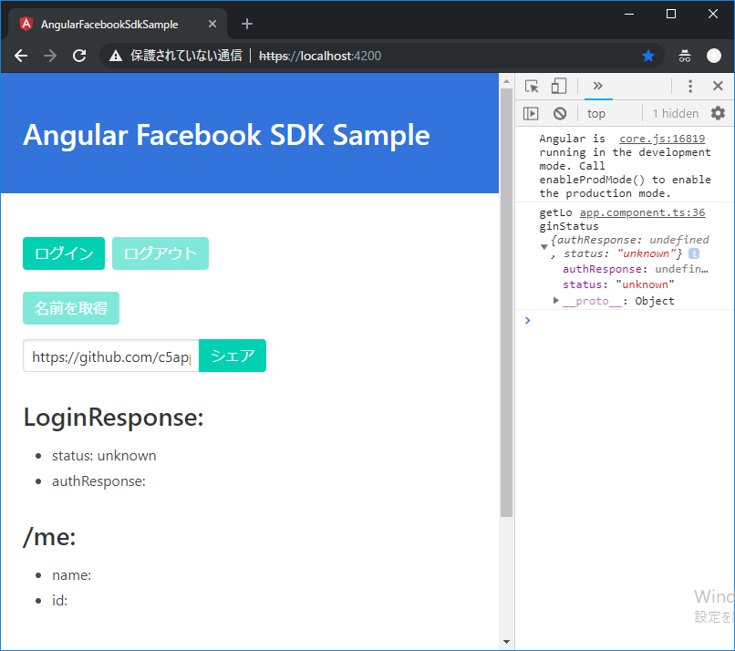

# AngularFacebookSdkSample

This project was generated with [Angular CLI](https://github.com/angular/angular-cli) version 7.3.1.

## 環境設定

[enviroment.ts](src/environments/environment.ts) のfacebook.appIdをご自身のIDに書き換えましょう。

```
export const environment = {
  production: false,
  facebook: {
    appId: '12345678', // ここを修正
    cookie: true,
    xfbml: true,
    version: 'v2.8'
  }
};
```

## 実行方法

SSLで実行しましょう。`ng serve --ssl`

## キャプチャ

